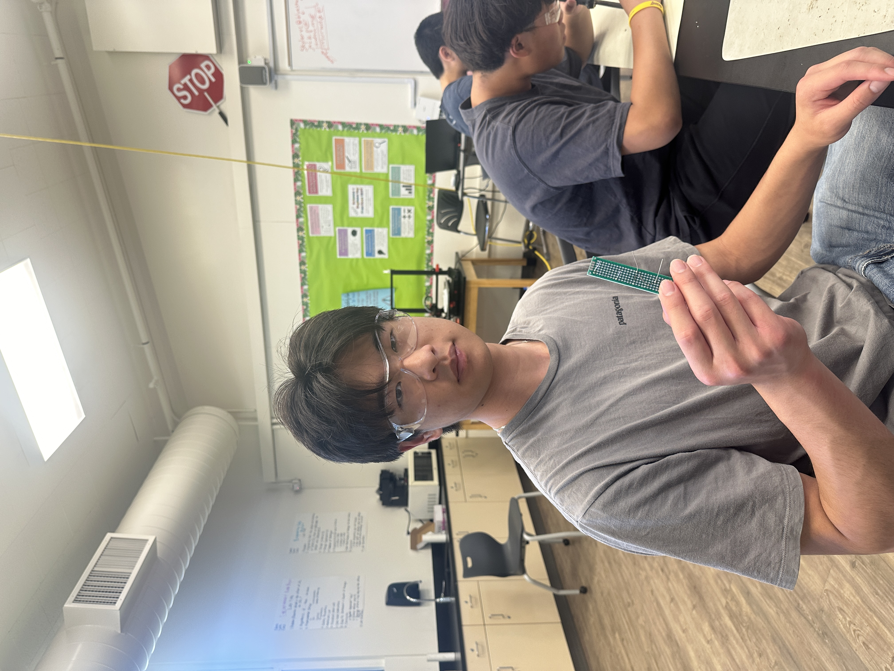

# Ball Tracking Robot
<!--Replace this text with a brief description (2-3 sentences) of your project. This description should draw the reader in and make them interested in what you've built. You can include what the biggest challenges, takeaways, and triumphs from completing the project were. As you complete your portfolio, remember your audience is less familiar than you are with all that your project entails!-->

<!--You should comment out all portions of your portfolio that you have not completed yet, as well as any instructions:
HTML -->
<!--- This is an HTML comment in Markdown -->
<!--- Anything between these symbols will not render on the published site -->


| **Engineer** | **School** | **Area of Interest** | **Grade** |
|:--:|:--:|:--:|:--:|
| Linus C | Homestead High School | Mechanical Engineering | Incoming Senior

<!--**Replace the BlueStamp logo below with an image of yourself and your completed project. Follow the guide [here](https://tomcam.github.io/least-github-pages/adding-images-github-pages-site.html) if you need help.**-->



  
<!-- # Final Milestone

**Don't forget to replace the text below with the embedding for your milestone video. Go to Youtube, click Share -> Embed, and copy and paste the code to replace what's below.**

<iframe width="560" height="315" src="https://www.youtube.com/embed/F7M7imOVGug" title="YouTube video player" frameborder="0" allow="accelerometer; autoplay; clipboard-write; encrypted-media; gyroscope; picture-in-picture; web-share" allowfullscreen></iframe>

For your final milestone, explain the outcome of your project. Key details to include are:
- What you've accomplished since your previous milestone
- What your biggest challenges and triumphs were at BSE
- A summary of key topics you learned about
- What you hope to learn in the future after everything you've learned at BSE


-->
<iframe width="560" height="315" src="https://www.youtube.com/embed/voiXY7UIDs4?si=q7NHlKg-riwDikNW" title="YouTube video player" frameborder="0" allow="accelerometer; autoplay; clipboard-write; encrypted-media; gyroscope; picture-in-picture; web-share" referrerpolicy="strict-origin-when-cross-origin" allowfullscreen></iframe>

# Second Milestone

<!--

**Don't forget to replace the text below with the embedding for your milestone video. Go to Youtube, click Share -> Embed, and copy and paste the code to replace what's below.**

<iframe width="560" height="315" src="https://www.youtube.com/embed/y3VAmNlER5Y" title="YouTube video player" frameborder="0" allow="accelerometer; autoplay; clipboard-write; encrypted-media; gyroscope; picture-in-picture; web-share" allowfullscreen></iframe>

For your second milestone, explain what you've worked on since your previous milestone. You can highlight:
- Technical details of what you've accomplished and how they contribute to the final goal
- What has been surprising about the project so far
- Previous challenges you faced that you overcame
- What needs to be completed before your final milestone 

-->

<iframe width="560" height="315" src="https://www.youtube.com/embed/2t-dJcI8XoY?si=1ZPrl4aSTyaytTRl" title="YouTube video player" frameborder="0" allow="accelerometer; autoplay; clipboard-write; encrypted-media; gyroscope; picture-in-picture; web-share" referrerpolicy="strict-origin-when-cross-origin" allowfullscreen></iframe>

## Summary
In my second milestone, I completed many of essential functions of my robot. The most challenging and important was getting the camera to detect the ball and create a mask around it. I also programmed the motors to turn the robot to face the ball and drive toward it. Additionally, I moved around certain parts of my robot as I finalized the position of each component. At the end of this milestone, the final shape and functionality of my robot really began to take shape.

## Components Used


# First Milestone

<!--

**Don't forget to replace the text below with the embedding for your milestone video. Go to Youtube, click Share -> Embed, and copy and paste the code to replace what's below.**

<iframe width="560" height="315" src="https://www.youtube.com/embed/CaCazFBhYKs" title="YouTube video player" frameborder="0" allow="accelerometer; autoplay; clipboard-write; encrypted-media; gyroscope; picture-in-picture; web-share" allowfullscreen></iframe>

For your first milestone, describe what your project is and how you plan to build it. You can include:
- An explanation about the different components of your project and how they will all integrate together
- Technical progress you've made so far
- Challenges you're facing and solving in your future milestones
- What your plan is to complete your project

-->

<iframe width="560" height="315" src="https://www.youtube.com/embed/jcE11z464T0?si=PnLsvyEAaqKAuGsx" title="YouTube video player" frameborder="0" allow="accelerometer; autoplay; clipboard-write; encrypted-media; gyroscope; picture-in-picture; web-share" referrerpolicy="strict-origin-when-cross-origin" allowfullscreen></iframe>

## Summary
Ultimately the goal for this project is to use the PIcam and OpenCV track a ball and use the motors and ultrasonic sensos to navigate toward it, as well as avoid any obstacles. For my first milestone, I constructed the main body of the car and wired each of my components. I downloaded Raspberry Pi OS on my Raspberry Pi and finished setting it up. I connected the camera, ultrasonic sensor and the motors. Additionally, I tested basic functionality of each of my components using some code.

## Components Used
- Raspberry Pi minicomputer
    - The Rasbperry Pi is the heart of the project and provides instructions to each of the other components of the robot. The Raspberry Pi is a microcomputer where the user can load or write programs onto. In addition to directing the instructions, the Raspberry Pi provides power to many of the other components.
- DC motors
    - These motors are used to drive the wheels and control the movement of the robot. This motor works by making use of an electromagnet which constantly switches its polarity by switching the direction of the current. This current direction switch is made possible with the commutator and brushes of the motor, which allows for the motor to constantly spin. 
- Ultrasonic sensors
    - The ultrasonic sensors allow the robot to know where it is in relation to the ball and any other objects in the room. These sensors work by sending out an ultrasound from the transmittor (trigger pin) and receiving it from the receiver (echo pin). By using some simple calculations including the speed of sound and dividing the final distance by 2 to account for both distances traveled, the ultrasonic sensor is very useful in applications such as this.
- L298N motor driver board
    - A dual H-Bridge motor driver board which makes use of a multitude of transistors, allows for this device to control the direction and speed of two different motors, making it a very useful addition for a project such as this. The Raspberry Pi alone is not powerful enough to run the motors, so the driver board also provides power to the motors.

## Challenges 
I faced various difficulties while setting up my Raspberry Pi. First, I installed the wrong version of the OS. Additionally, I encountered numerous issues with displaying the contents of my Raspberry Pi on my laptop. I initally attempetd to use RealVNC Viewer, however connecting to the Raspberry Pi was inconsistent and failed often. I connected the Raspberry Pi to my laptop with a video capture card and used OBS to view the contents. I connected a wireless mouse and keyboard to the Raspberrry Pi and was able to interact with the desktop while viewing the video output on OBS.

## What's Next?
The next major goal for my project is to get the Picamera to recognize and track the ball, using OpenCV. Once this has been achieved, the majority of the project has been finished and I can begin integrating the rest of the functionality of my robot.

<!--

# Schematics 
Here's where you'll put images of your schematics. [Tinkercad](https://www.tinkercad.com/blog/official-guide-to-tinkercad-circuits) and [Fritzing](https://fritzing.org/learning/) are both great resoruces to create professional schematic diagrams, though BSE recommends Tinkercad becuase it can be done easily and for free in the browser. 

# Code
Here's where you'll put your code. The syntax below places it into a block of code. Follow the guide [here]([url](https://www.markdownguide.org/extended-syntax/)) to learn how to customize it to your project needs. 

```c++
void setup() {
  // put your setup code here, to run once:
  Serial.begin(9600);
  Serial.println("Hello World!");
}

void loop() {
  // put your main code here, to run repeatedly:

}
```

-->

# Bill of Materials

| **Part** | **Note** | **Price** | **Link** |
|:--:|:--:|:--:|:--:|
| Raspberri Pi 4 Model B | Minicomputer used to write code and control the robot | $79.97 | <a href="https://www.amazon.com/Raspberry-Model-2019-Quad-Bluetooth/dp/B07TC2BK1X?source=ps-sl-shoppingads-lpcontext&ref_=fplfs&smid=A2QE71HEBJRNZE&th=1"> <ins>Link</ins> </a> |
|:--:|:--:|:--:|:--:|
| Raspberry Pi Camera Module | The camera used for live video capture. | $14.99 | <a href="https://www.amazon.com/Arducam-Autofocus-Raspberry-Motorized-Software/dp/B07SN8GYGD/ref=sr_1_5?crid=3236VFT39VAPQ&keywords=picamera&qid=1689698732&s=electronics&sprefix=picamer%2Celectronics%2C138&sr=1-5"> <ins>Link</ins> </a> |
|:--:|:--:|:--:|:--:|
| L298N Driver Board | Basic motor driver board which drives the wheels forward and backward. | $8.99 | <a href="https://www.amazon.com/Qunqi-2Packs-Controller-Stepper-Arduino/dp/B01M29YK5U/ref=sr_1_1_sspa?crid=3DE9ZH0NI3KJX&keywords=l298n&qid=1689698859&s=electronics&sprefix=l298n%2Celectronics%2C164&sr=1-1-spons&sp_csd=d2lkZ2V0TmFtZT1zcF9hdGY&psc=1"> <ins>Link</ins> </a> |
|:--:|:--:|:--:|:--:|
| Motors and Board kit | Basic hardware pieces for structural assembly of the robot. | $13.59 | <a href="https://www.amazon.com/Smart-Chassis-Motors-Encoder-Battery/dp/B01LXY7CM3/ref=sr_1_4?crid=27ACD61NPNLO4&keywords=robot+car+kit&qid=1689698962&s=electronics&sprefix=robot+car+kit%2Celectronics%2C169&sr=1-4"> <ins>Link</ins> </a> |
|:--:|:--:|:--:|:--:|
| Powerbank | Compact and portable external power supply with USB-C for Raspberry Pi | $21.98 | <a href="https://www.amazon.com/Anker-Ultra-Compact-High-Speed-VoltageBoost-Technology/dp/B07QXV6N1B/ref=sr_1_1_sspa?crid=53ULGW8ZNDOW&keywords=power+bank&qid=1689699045&s=electronics&sprefix=power+bank%2Celectronics%2C144&sr=1-1-spons&sp_csd=d2lkZ2V0TmFtZT1zcF9hdGY&psc=1"> <ins>Link</ins> </a> |
|:--:|:--:|:--:|:--:|
| HC-SR04 sensors (5 pcs) | Used for distance calculations of unwanted obstacles or objects. | $8.99 | <a href="https://www.amazon.com/Organizer-Ultrasonic-Distance-MEGA2560-ElecRight/dp/B07RGB4W8V/ref=sr_1_2?crid=UYI359LWAAVU&keywords=hc+sr04+ultrasonic+sensor+3+pc&qid=1689699122&s=electronics&sprefix=hc+sr04+ultrasonic+sensor+3+pc%2Celectronics%2C123&sr=1-2"> <ins>Link</ins> </a> |
|:--:|:--:|:--:|:--:|
| HDMI to micro HDMI cable | Used to display Pi contents on monitor. | $8.99 | <a href="https://www.amazon.com/UGREEN-Adapter-Ethernet-Compatible-Raspberry/dp/B06WWQ7KLV/ref=sr_1_5?crid=3S06RDX7B1X4O&keywords=hdmi+to+micro+hdmi&qid=1689699482&s=electronics&sprefix=hdmi+to+micro%2Celectronics%2C132&sr=1-5"> <ins>Link</ins> </a> |
|:--:|:--:|:--:|:--:|
| Video Capture card | Capture card is necessary to display onto laptops (unnecessary for separate monitors). | $16.98 | <a href="https://www.amazon.com/Capture-Streaming-Broadcasting-Conference-Teaching/dp/B09FLN63B3/ref=sr_1_3?crid=19YSORXLTIALH&keywords=video+capture+card&qid=1689699799&s=electronics&sprefix=video+capture+car%2Celectronics%2C140&sr=1-3"> <ins>Link</ins> </a> |
|:--:|:--:|:--:|:--:|
| SD card reader | Necessary to flash your microSD and install an OS onto it. | $4.99 | <a href="https://www.amazon.com/Reader-Adapter-Camera-Memory-Wansurs/dp/B0B9QZ4W4Y/ref=sr_1_4?crid=F124KSQOC5SO&keywords=sd+card+reader&qid=1689869007&sprefix=sd+card+reader%2Caps%2C126&sr=8-4"> <ins>Link</ins> </a> |
|:--:|:--:|:--:|:--:|
| Wireless Mouse and Keyboard | A separate Mouse and Keyboard is needed to operate the Raspberry Pi. | $25.99 | <a href="https://www.amazon.com/Wireless-Keyboard-Trueque-Cordless-Computer/dp/B09J4RQFK7/ref=sr_1_1_sspa?crid=2R048HRMFBA7Z&keywords=mouse+and+keyboard+wireless&qid=1689871090&sprefix=mouse+and+keyboard+wireless+%2Caps%2C131&sr=8-1-spons&sp_csd=d2lkZ2V0TmFtZT1zcF9hdGY&psc=1"> <ins>Link</ins> </a> |
|:--:|:--:|:--:|:--:|
| Basic connections components kit | This includes necessary components for connections such as: breadboard, jumper wires (male-to-male and male-to-female), resistors, and LEDs.  | $11.47 | <a href="https://www.amazon.com/Smraza-Breadboard-Resistors-Mega2560-Raspberry/dp/B01HRR7EBG/ref=sr_1_16?crid=27G99F3EADUCG&keywords=breadboard+1+pc&qid=1689894556&sprefix=breadboard+1+p%2Caps%2C185&sr=8-16"> <ins>Link</ins> </a> |
|:--:|:--:|:--:|:--:|
| Female to Female Jumper Wires | Jumper wires that are necessary for sensor and input motor connections (not included in connections kit above). | $7.98 | <a href="https://www.amazon.com/EDGELEC-Breadboard-1pin-1pin-Connector-Multicolored/dp/B07GCY6CH7/ref=sr_1_3?crid=3C4YB6HOGZ8ZQ&keywords=female%2Bto%2Bfemale%2Bjumper&qid=1689894791&s=electronics&sprefix=female%2Bto%2Bfemale%2Bjumper%2Celectronics%2C161&sr=1-3&th=1"> <ins>Link</ins> </a> |
|:--:|:--:|:--:|:--:|
| Soldering Kit | Soldering kit for motor connections (and solderable breadboard, optional).  | $13.59 | <a href="https://www.amazon.com/Soldering-Interchangeable-Adjustable-Temperature-Enthusiast/dp/B087767KNW/ref=sr_1_5?crid=1QYWI5SBQAPH0&keywords=soldering+kit&qid=1689900771&sprefix=soldering+kit%2Caps%2C169&sr=8-5"> <ins>Link</ins> </a> |
|:--:|:--:|:--:|:--:|


# Starter Project

<iframe width="560" height="315" src="https://www.youtube.com/embed/flsPcG2cskM?si=XTX2YYClHUA8_DDp" title="YouTube video player" frameborder="0" allow="accelerometer; autoplay; clipboard-write; encrypted-media; gyroscope; picture-in-picture; web-share" referrerpolicy="strict-origin-when-cross-origin" allowfullscreen></iframe>

## Summary
For my starter project, I chose to build a handheld game console. The project combines multiple different components in order to capture inputs, display them on an LED display, and keep track of score. The IC chip is soldered onto the board and takes inputs from the switch and various buttons. The chip is connected to the LED dot matrix, allowing it to display the game pieces and any inputs provided by the player. Additionally, the chip controls the score counter and the buzzer to create noise.
## Components Used
- IC chip
- Buzzer
- LED Dot Matrix
- PCB
- Digitron Display
- Electric Capacitor


## Challenges faced
Soldering was difficult on the board, as each component was small and intricate. There were many different connection points required for each component and it was tedious to solder each wire. This was my first time ever soldering and my inexperience added to the difficulty. One problem I faced was pressing each component firmly into its slot while soldering. One trick I used was to press the component in and solder two wires on opposite sides. This held the component in place, making the rest of the soldering fairly simple. Overall, I found that it was effective to work slowly and carefully. It is much more difficult to remove solder from somewhere it shouldn't be. 

<!--# Other Resources/Examples
One of the best parts about Github is that you can view how other people set up their own work. Here are some past BSE portfolios that are awesome examples. You can view how they set up their portfolio, and you can view their index.md files to understand how they implemented different portfolio components.
- [Example 1](https://trashytuber.github.io/YimingJiaBlueStamp/)
- [Example 2](https://sviatil0.github.io/Sviatoslav_BSE/)
- [Example 3](https://arneshkumar.github.io/arneshbluestamp/)

To watch the BSE tutorial on how to create a portfolio, click here. -->
